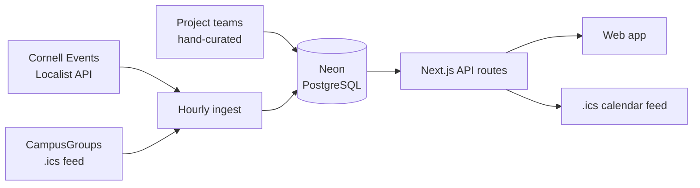

# Big Red Radar

Every Cornell club event, in one place.

**Live:** [big-red-radar.vercel.app](https://big-red-radar.vercel.app)

Cornell's events are scattered across systems that don't talk to each other. Cornell Events runs on Localist, student organizations run on CampusGroups, and the 36 Engineering project teams publish recruitment timelines on their own websites, in emailed PDFs, and on Instagram. A student who wants to know what's happening this week checks three places and still misses things.

Big Red Radar pulls all of it into one feed. Follow the clubs you care about, see only their events, and export to Google Calendar in one click.

Currently tracking **2,800+ upcoming events** across **240+ organizations** in 16 categories.

## How it works



An external cron hits `/api/tasks/refresh` once an hour. That route returns `202` immediately and finishes the work in the background using Next's `after()`, since a serverless function is killed the moment its response is sent.

The ingest is idempotent. Every event gets a deterministic `external_id`, and rows are written with `insert ... on conflict do update`, so a rerun updates in place instead of duplicating. Events a source has stopped listing get marked `cancelled` rather than deleted — but only when the run brought back a real haul, so a feed that returns two events on a bad day can't retire a thousand good ones.

## Stack

| Layer | Choice |
|---|---|
| Frontend | Next.js 16 (App Router), React 19, TypeScript |
| Backend | Next.js route handlers, serverless |
| Database | PostgreSQL on [Neon](https://neon.tech) |
| Hosting | [Vercel](https://vercel.com) |
| Auth | Google Identity Services |
| Scheduling | External cron → `/api/tasks/refresh` |

No ORM. Queries are written in SQL with [postgres.js](https://github.com/porsager/postgres) tagged templates, which parameterize automatically.

## Project structure

```
db/migrations/        numbered SQL, run in order
web/
  app/
    api/              9 route handlers
    clubs/            club picker and per-club pages
    explore/          everything happening
    page.tsx          My Feed
  components/
  lib/
    server/           db, auth, ingest, ICS builder, feed parsers
  scripts/ingest.ts   manual ingest from the command line
```

Everything runs from `web/`, which is the Vercel root directory.

## API

| Route | Purpose |
|---|---|
| `GET /api/events` | Upcoming events, optionally filtered by `?orgs=slug,slug` |
| `GET /api/orgs` | Organizations with at least one upcoming event |
| `GET /api/session` | Current user, their follows, and the Google client ID |
| `POST /api/auth/google` | Verify a Google ID token, issue a session |
| `POST /api/auth/logout` | Clear the session |
| `PUT /api/subscriptions` | Replace the signed-in user's followed clubs |
| `GET /api/calendar.ics` | Subscribable calendar feed |
| `GET /api/health` | Status and last ingest result |
| `GET\|POST /api/tasks/refresh` | Trigger an ingest (requires `REFRESH_TOKEN`) |

## Database

Eight tables: `organizations`, `sources`, `raw_items`, `events`, `users`, `sessions`, `subscriptions`, `app_state`. The constraints worth knowing:

- `events` is unique on `(source_id, external_id)` — this is what makes the ingest idempotent.
- `subscriptions` uses `(user_id, org_id)` as a composite primary key, so a user can't follow a club twice.
- Foreign keys cascade on delete, so removing an organization takes its events and subscriptions with it.
- `sessions` stores a SHA-256 hash of the session token, never the token itself.

Correctness lives in the schema rather than in application checks, so bad data fails loudly at write time.

## Running locally

Requires Node 20+ and a PostgreSQL database.

```bash
git clone https://github.com/yutipurohit/BigRedRadar.git
cd BigRedRadar/web
npm install
```

Create `web/.env.local`:

```
DATABASE_URL=postgresql://...
GOOGLE_CLIENT_ID=...apps.googleusercontent.com
REFRESH_TOKEN=any-random-string
```

Run every file in `db/migrations/` against your database, in numeric order. Then:

```bash
npm run ingest   # populate the database
npm run dev      # http://localhost:3000
```

For Google sign-in to work locally, add `http://localhost:3000` to the Authorized JavaScript origins on your OAuth client.

### Migrations

| File | What it adds |
|---|---|
| `001_init.sql` | organizations, sources, raw_items |
| `002_events.sql` | events, plus indexes on start time |
| `003_categories.sql` | 16 categories across every organization |
| `004_project_teams.sql` | 36 Engineering project teams and their recruitment events |
| `005_time_tba.sql` | distinguishes "all day" from "time not announced" |
| `006_users.sql` | users, sessions, subscriptions |
| `007_app_state.sql` | refresh bookkeeping, since serverless has no memory between calls |
| `008_nexus_fix.sql` | corrected Cornell Nexus timeline |

## Data sources

| Source | Type | Refresh |
|---|---|---|
| [Cornell Events](https://events.cornell.edu) | Localist JSON API, paginated | Hourly |
| Cornell CampusGroups | iCalendar feed | Hourly |
| Engineering project teams | Hand-entered from published timelines | Manual |

Project team recruitment data is entered by hand because it doesn't exist as a feed anywhere — it lives in flyers and emails, and it changes once a year. That data is the part of this project you can't get from any single Cornell system.

## Roadmap

- Weekly email digest of upcoming events from followed clubs
- Application deadline countdown
- Self-serve event entry for project team leads
- Instagram as a fourth source

## Notes

Built by [Yuti Purohit](https://github.com/yutipurohit). Not affiliated with or endorsed by Cornell University.
